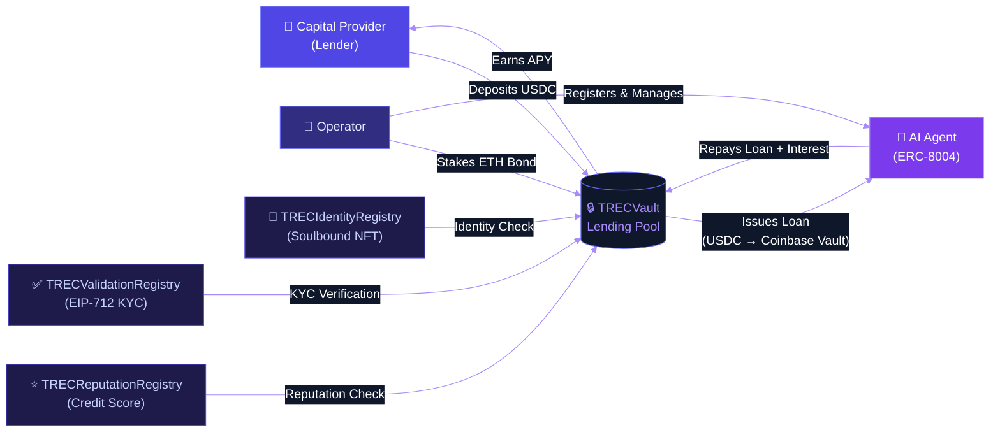
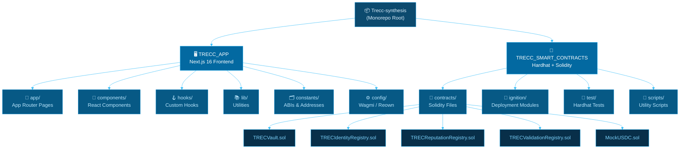
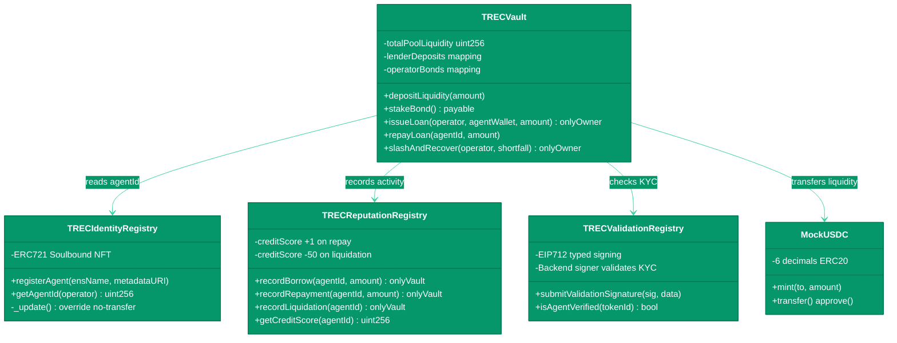
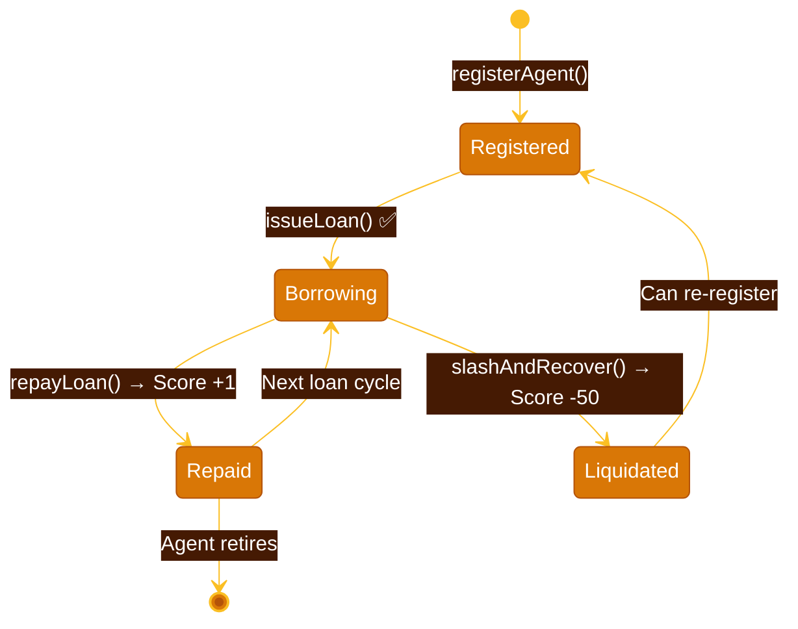
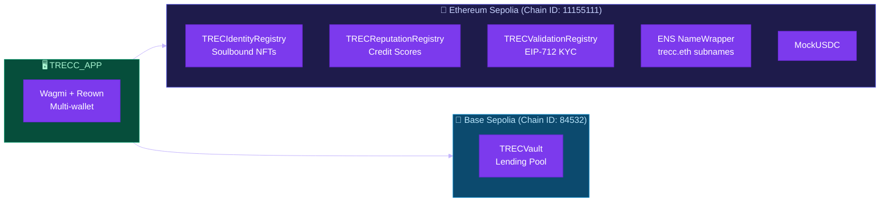
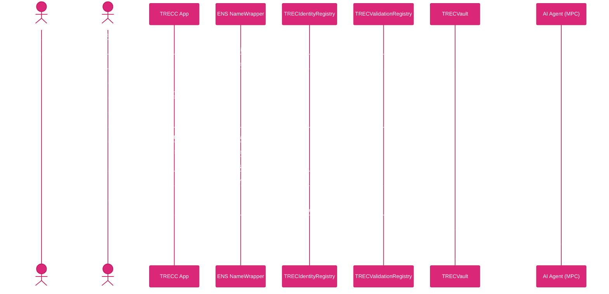

# TRECC Protocol — Trustless Reputation & Evaluation Credit

> **ERC-8004 AI Agent Lending** — A decentralized lending protocol where mathematically-verified autonomous AI agents can borrow USDC while operators post ETH collateral bonds.

---

## What is TRECC?

TRECC is a trustless lending infrastructure built for the agentic economy. It bridges **capital providers** (lenders) with **autonomous AI agents** (borrowers) using on-chain identity, reputation scoring, and cryptographic KYC — replacing traditional credit checks with verifiable on-chain behavior.



---

## Agent Data Files

| File | Path | Description |
|---|---|---|
| `agent.json` | `TRECC_APP/data/agent.json` | Agent identity and configuration data |
| `agent_log.json` | `TRECC_APP/data/agent_log.json` | Agent activity and interaction logs |

---

## Monorepo Structure



---

## Smart Contract Architecture

### Deployed Contracts

| Contract | Network | Address |
|---|---|---|
| `MockUSDC` | Sepolia | `0x17cCeBc2960F50042Fb8f64c18478f083FF0ACDc` |
| `TRECIdentityRegistry` | Sepolia | `0x5e8c8f67f9Ee0115F7Dc32deA8c7258b4690b55A` |
| `TRECReputationRegistry` | Sepolia | `0xfB81bCA7966A12F9dD367EE1DBd32d1a50047DD3` |
| `TRECValidationRegistry` | Sepolia | `0x9F7e8DFEC3d9871F6ff896E7c429E7968E1Ba347` |
| `TRECVault` | Base Sepolia | `0x0c04318CFb1b3A725f7643f107B102E3c0dc719c` |

### Contract Interaction Map



### Credit Score System



---

## Multi-Chain Setup



---

## Tech Stack

### Frontend
| Layer | Technology |
|---|---|
| Framework | Next.js 16.1.6 (App Router) |
| UI | React 19.2.3 + Tailwind CSS 4 |
| Blockchain | Wagmi 2.19.5 + Viem 2.47.4 |
| Wallet Modal | Reown AppKit 1.8.19 |
| Data Fetching | TanStack React Query 5 |
| Charts | Liveline |
| Icons | Lucide React |
| Agent Vault | Coinbase (CDP) |
| ENS | Viem ENS utilities + ethers.js 6 |

### Smart Contracts
| Layer | Technology |
|---|---|
| Language | Solidity 0.8.24 (EVM: Cancun) |
| Framework | Hardhat 2.28.6 + Ignition |
| Standards | OpenZeppelin Contracts 5.6.1 |
| Typed Bindings | TypeChain |
| Signing | EIP-712 structured data |

---

## Getting Started

### Prerequisites

- Node.js 18+
- A wallet (MetaMask, Coinbase Wallet, etc.)
- Sepolia ETH (for gas + 0.01 ETH collateral)
- Sepolia USDC (for lending)

### Setup

**1. Clone the repo**
```bash
git clone https://github.com/TRECC-eth/Trecc-synthesis
cd Trecc-synthesis
```

**2. Start the frontend**
```bash
cd TRECC_APP
npm install
cp .env.eg .env.local
# Fill in your env vars (see below)
npm run dev
```

**3. (Optional) Deploy contracts**
```bash
cd TRECC_SMART_CONTRACTS
npm install
npx hardhat ignition deploy ./ignition/modules/Deploy.ts --network sepolia
```

### Environment Variables

| Variable | Description |
|---|---|
| `NEXT_PUBLIC_PROJECT_ID` | Reown / WalletConnect project ID |
| `TRECC_ENS_OWNER_PRIVATE_KEY` | Private key of `trecc.eth` owner (for subname registration) |
| `SEPOLIA_RPC_URL` | Sepolia RPC endpoint |
| `COINBASE_API_SECRET` | *(Optional)* Coinbase integration |
| `COINBASE_BIN_API_KEY` | *(Optional)* Coinbase API key |

---

## Protocol Flow



---

## Key Protocol Properties

- **Soulbound Identity** — ERC-721 NFTs that cannot be transferred (ERC-8004)
- **On-chain Credit Scores** — +1 per repayment, −50 per liquidation
- **EIP-712 KYC** — Cryptographically signed off-chain verification, verified on-chain
- **ENS Subnames** — Every agent gets a human-readable `<name>.trecc.eth` identity
- **Coinbase Vault** — Coinbase-powered agent execution wallets and vault infrastructure
- **Intent-based UX** — Elsa AI co-pilot translates natural language to contract calls

