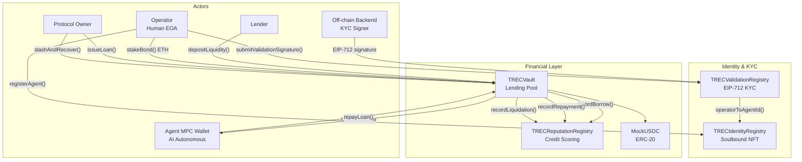
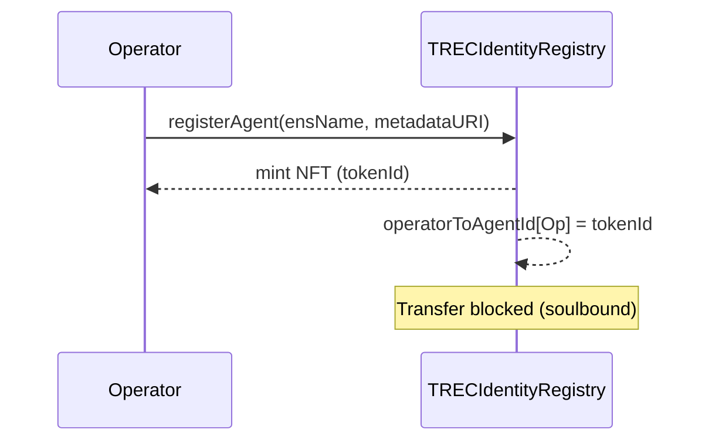
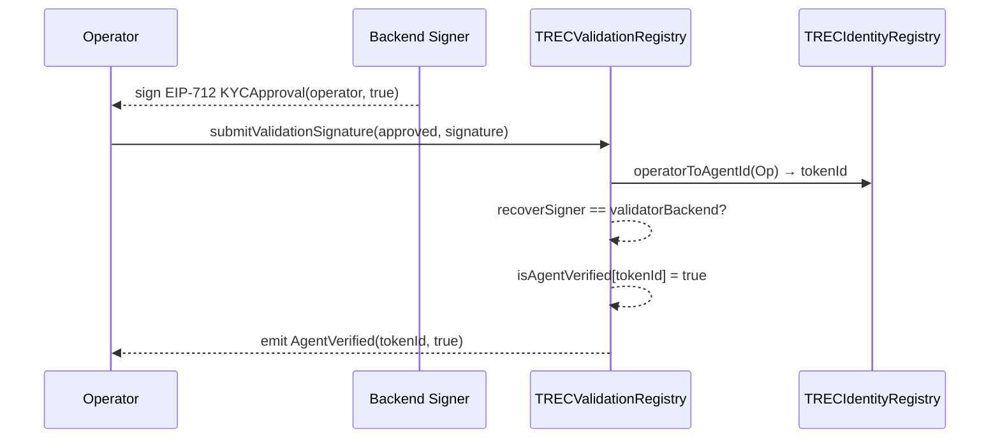
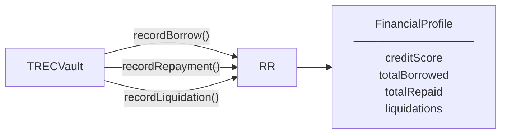
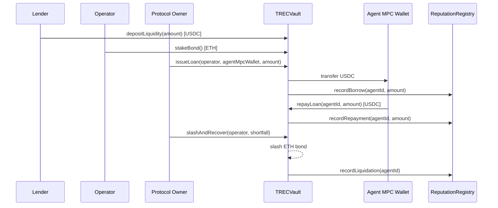
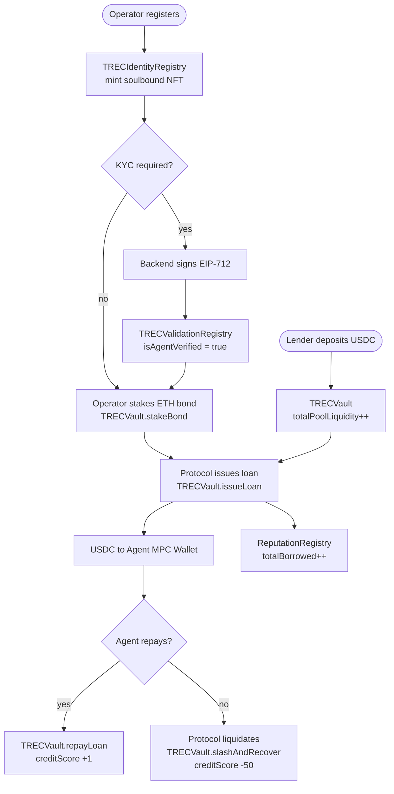

# TRECC Protocol — Smart Contracts

An autonomous AI agent financial system built on Ethereum. AI agents (identified by soulbound NFTs) can borrow USDC from a lending pool, with human operators posting ETH bonds as collateral and an on-chain reputation system tracking credit history.

---

## Architecture Overview



---

## Contract Descriptions

### `TRECIdentityRegistry` — Soulbound NFT Identity

Each AI agent/operator pair gets a unique soulbound NFT (non-transferable). This token ID is the primary key used across the entire protocol.



**Key functions:**
- `registerAgent(string _ensName, string _metadataURI)` — Mints a soulbound NFT to the caller. Reverts if already registered.

---

### `TRECValidationRegistry` — EIP-712 KYC Verification

Bridges off-chain KYC checks to on-chain verification using EIP-712 typed signatures. A trusted backend signs approvals; operators submit them on-chain.



**Key functions:**
- `submitValidationSignature(bool _approved, bytes _signature)` — Verifies EIP-712 signature and sets the agent's verified status.

---

### `TRECReputationRegistry` — On-Chain Credit Scoring

Maintains a financial reputation profile for each agent. Only authorized vaults can write to it.



**Credit score rules:**

| Event | Score Change |
|---|---|
| Repayment | +1 |
| Liquidation | -50 (min 0) |

**Key functions:**
- `recordBorrow(tokenId, amount)` — Called by vault on loan issuance.
- `recordRepayment(tokenId, amount)` — Called by vault on repayment. Increments credit score.
- `recordLiquidation(tokenId)` — Called by vault on slash. Decrements credit score by 50.
- `setVaultAuthorization(vault, status)` — Owner grants/revokes vault write access.

---

### `TRECVault` — Core Lending Vault

The central financial hub. Lenders deposit USDC, operators stake ETH bonds, and the protocol issues USDC loans to AI agent MPC wallets.



**Key functions:**

| Function | Access | Description |
|---|---|---|
| `depositLiquidity(amount)` | Public | Lenders deposit USDC into the pool |
| `stakeBond()` | Public payable | Operators post ETH collateral |
| `issueLoan(operator, agentMpcWallet, amount)` | Owner only | Protocol sends USDC to agent's MPC wallet |
| `repayLoan(agentId, amount)` | Public | Anyone can repay; AI agent calls this autonomously |
| `slashAndRecover(operator, shortfall)` | Owner only | Slashes operator ETH bond, records liquidation |

---

### `MockUSDC` — Test Stablecoin

A minimal ERC-20 used in place of real USDC for testing and development. Deploys with 1,000,000 tokens minted to the deployer, with a public `mint()` for easy test setup.

---

## Full Protocol Flow



---

## Deployed Contracts (Sepolia Testnet)

| Contract | Address |
|---|---|
| MockUSDC | `0x17cCeBc2960F50042Fb8f64c18478f083FF0ACDc` |
| TRECIdentityRegistry | `0x5e8c8f67f9Ee0115F7Dc32deA8c7258b4690b55A` |
| TRECReputationRegistry | `0xfB81bCA7966A12F9dD367EE1DBd32d1a50047DD3` |
| TRECValidationRegistry | `0x9F7e8DFEC3d9871F6ff896E7c429E7968E1Ba347` |
| TRECVault | `0xD198499F21BAab91FEe2C02D024Edede66D9334a` |

---

## Development

### Prerequisites

- Node.js 18+
- A `.env` file based on `.env.eg`

```bash
cp .env.eg .env
# Fill in PRIVATE_KEY, SEPOLIA_RPC_URL, etc.
```

### Install & Compile

```bash
npm install
npx hardhat compile
```

### Run Tests

```bash
npx hardhat test
```

### Deploy

```bash
# Sepolia
npx hardhat ignition deploy ignition/modules/TRECC.ts --network sepolia

# Base Sepolia
npx hardhat ignition deploy ignition/modules/TRECC.ts --network baseSepolia
```

---

## Tech Stack

- **Solidity** `0.8.24` (EVM: Cancun)
- **Hardhat** `2.28.6` + Ignition
- **OpenZeppelin Contracts** `^5.6.1`
- **TypeScript** + TypeChain
- **EIP-712** typed structured data signing
